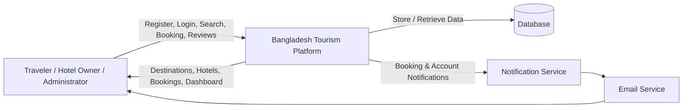
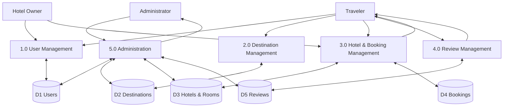

# Bangladesh Tourism Platform – Data Flow Diagrams (DFD)

## Context Diagram

---

# Level 0 DFD

---

# Level 1 DFD – Process Decomposition

```mermaid
flowchart TD

subgraph UM[1.0 User Management]
    UM1[1.1 Register]
    UM2[1.2 Login]
    UM3[1.3 Profile Management]
    UM4[1.4 Role Authorization]
end

subgraph DM[2.0 Destination Management]
    DM1[2.1 Browse Destinations]
    DM2[2.2 Search & Filter]
    DM3[2.3 View Destination Details]
end

subgraph HB[3.0 Hotel & Booking Management]
    HB1[3.1 Add / Update Hotel]
    HB2[3.2 Manage Rooms]
    HB3[3.3 Hotel Booking]
    HB4[3.4 Booking History]
end

subgraph RM[4.0 Review Management]
    RM1[4.1 Submit Review]
    RM2[4.2 View Reviews]
    RM3[4.3 Report Review]
end

subgraph AM[5.0 Administration]
    AM1[5.1 Approve Hotels]
    AM2[5.2 Manage Users]
    AM3[5.3 Manage Destinations]
    AM4[5.4 Moderate Reviews]
end

DBU[(Users)]
DBD[(Destinations)]
DBH[(Hotels)]
DBB[(Bookings)]
DBR[(Reviews)]

UM1 --> DBU
UM2 --> DBU
UM3 --> DBU
UM4 --> DBU

DM1 --> DBD
DM2 --> DBD
DM3 --> DBD

HB1 --> DBH
HB2 --> DBH
HB3 --> DBB
HB3 --> DBH
HB4 --> DBB

RM1 --> DBR
RM2 --> DBR
RM3 --> DBR

AM1 --> DBH
AM2 --> DBU
AM3 --> DBD
AM4 --> DBR

classDef db fill:#f2f2f2,stroke:#777,stroke-width:1px;

class DBU,DBD,DBH,DBB,DBR db;
```

---

# Data Stores

| Data Store            | Description                                                               |
| --------------------- | ------------------------------------------------------------------------- |
| **D1 Users**          | Stores traveler, hotel owner, and administrator account information.      |
| **D2 Destinations**   | Stores tourist destination details, descriptions, images, and categories. |
| **D3 Hotels & Rooms** | Stores hotel information, room details, pricing, and availability.        |
| **D4 Bookings**       | Stores hotel booking records, booking status, and reservation history.    |
| **D5 Reviews**        | Stores user ratings, reviews, and reported review information.            |

---

# External Entities

| Entity            | Description                                                                    |
| ----------------- | ------------------------------------------------------------------------------ |
| **Traveler**      | Searches destinations, books hotels, and submits reviews.                      |
| **Hotel Owner**   | Manages hotels, rooms, and booking requests.                                   |
| **Administrator** | Manages users, destinations, hotels, approvals, and reviews.                   |
| **Email Service** | Sends booking confirmations, account notifications, and password reset emails. |

---

# Process Summary

| Process                            | Description                                                                                          |
| ---------------------------------- | ---------------------------------------------------------------------------------------------------- |
| **1.0 User Management**            | Handles registration, authentication, profile management, and role-based authorization.              |
| **2.0 Destination Management**     | Manages destination browsing, searching, filtering, and detailed information retrieval.              |
| **3.0 Hotel & Booking Management** | Handles hotel management, room management, bookings, and reservation history.                        |
| **4.0 Review Management**          | Allows travelers to submit reviews, view ratings, and report inappropriate content.                  |
| **5.0 Administration**             | Enables administrators to manage users, approve hotels, maintain destinations, and moderate reviews. |
