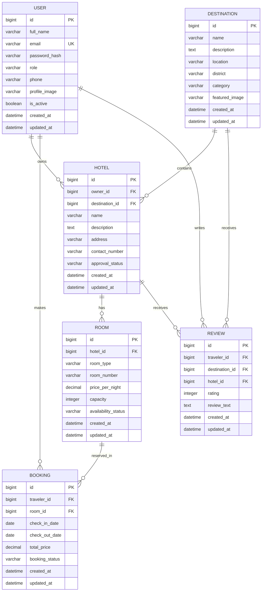

# Bangladesh Tourism Platform – Entity Relationship Diagram (ERD)

> **Note:** This ERD represents the **logical database model** used for system analysis and software design. The physical database implementation using **PostgreSQL** is documented separately in `database-design.md`.

---

# Entity Overview

| Entity      | Purpose                                                              |
| ----------- | -------------------------------------------------------------------- |
| User        | Stores traveler, hotel owner, and administrator account information. |
| Destination | Stores tourist destination details and location information.         |
| Hotel       | Stores hotel information submitted by hotel owners.                  |
| Room        | Stores hotel room details, pricing, and availability.                |
| Booking     | Stores hotel reservation records created by travelers.               |
| Review      | Stores traveler ratings and reviews for destinations and hotels.     |

---

# Entity Attributes

## User

`id, full_name, email, password_hash, role, phone, profile_image, is_active, created_at, updated_at`

---

## Destination

`id, name, description, location, district, category, featured_image, created_at, updated_at`

---

## Hotel

`id, owner_id, destination_id, name, description, address, contact_number, approval_status, created_at, updated_at`

---

## Room

`id, hotel_id, room_type, room_number, price_per_night, capacity, availability_status, created_at, updated_at`

---

## Booking

`id, traveler_id, room_id, check_in_date, check_out_date, total_price, booking_status, created_at, updated_at`

---

## Review

`id, traveler_id, destination_id, hotel_id, rating, review_text, created_at, updated_at`

---

# Relationship Rules

* One **User** can create many **Bookings**.
* One **User (Hotel Owner)** can manage multiple **Hotels**.
* One **Destination** can contain multiple **Hotels**.
* One **Hotel** belongs to one **Destination**.
* One **Hotel** can contain multiple **Rooms**.
* One **Room** can have many **Bookings** over time.
* One **Traveler** can create multiple **Reviews**.
* Reviews may be associated with either a **Destination** or a **Hotel**.
* Administrators manage users, destinations, hotels, and reviews through role-based access control.

---

# Mermaid ER Diagram

---

# Relationship Summary

| Parent Entity | Child Entity | Relationship |
| ------------- | ------------ | ------------ |
| User          | Hotel        | One-to-Many  |
| User          | Booking      | One-to-Many  |
| User          | Review       | One-to-Many  |
| Destination   | Hotel        | One-to-Many  |
| Destination   | Review       | One-to-Many  |
| Hotel         | Room         | One-to-Many  |
| Hotel         | Review       | One-to-Many  |
| Room          | Booking      | One-to-Many  |

---

# Design Notes

* Every authenticated user has exactly one role (**Traveler**, **Hotel Owner**, or **Administrator**).
* Hotels remain in a **Pending** state until approved by an administrator.
* Bookings are associated with individual rooms rather than hotels to support multiple room types and availability management.
* Reviews are created only by authenticated travelers and are linked to completed travel experiences.
* The logical model is normalized to minimize data redundancy and maintain referential integrity.
