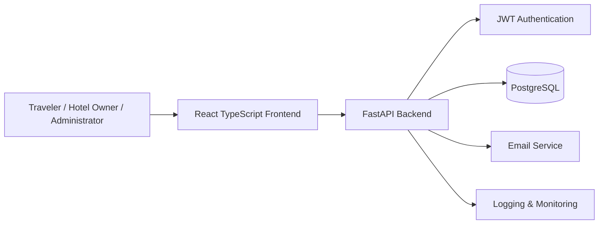
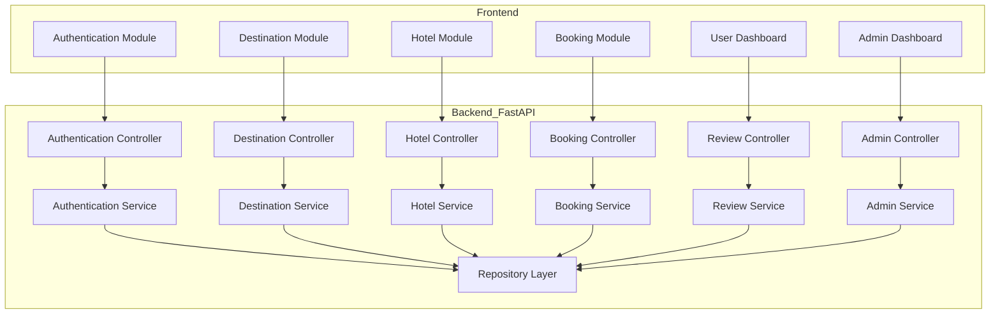
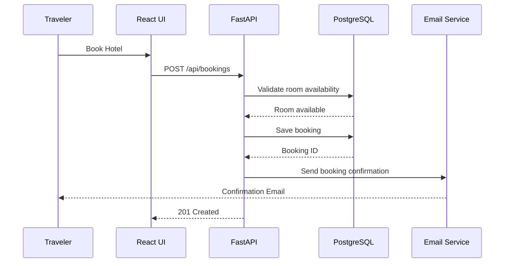
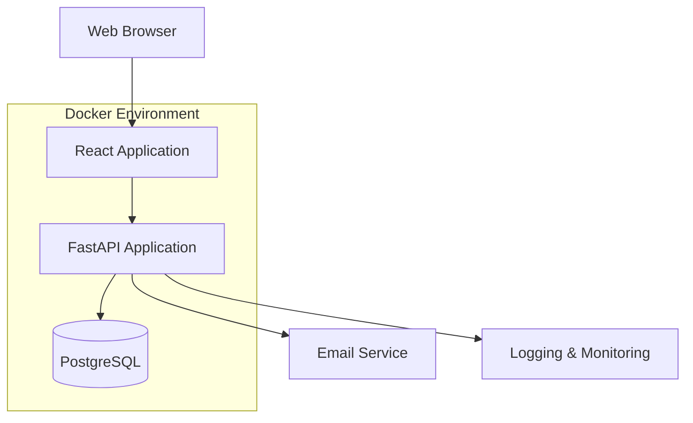

# Bangladesh Tourism Platform – System Design

## High-Level Design

The Bangladesh Tourism Platform follows a modern layered architecture that separates user interaction, business logic, and data persistence to improve scalability, maintainability, and security.

* **Presentation Layer:** React (TypeScript) Single Page Application (SPA)
* **Application Layer:** FastAPI backend providing RESTful APIs, authentication, booking management, and business logic
* **Data Layer:** PostgreSQL relational database for persistent storage
* **Platform Layer:** Dockerized deployment with monitoring and logging support

---

# Architecture Diagram

---

# Component Diagram

---

# Booking Data Flow

---

# Security Architecture

| Layer    | Control                                                               |
| -------- | --------------------------------------------------------------------- |
| Identity | JWT Authentication with role-based access control (RBAC)              |
| API      | Protected endpoints, request validation, and authorization middleware |
| Data     | Password hashing (bcrypt), TLS encryption, input validation           |
| Database | Foreign key constraints, transactions, and referential integrity      |
| Audit    | Administrative activity logging and security event recording          |

---

# Deployment Architecture

---

# Technology Stack

| Layer             | Technology                      |
| ----------------- | ------------------------------- |
| Frontend          | React, TypeScript, Tailwind CSS |
| Backend           | Python FastAPI                  |
| Authentication    | JWT                             |
| Database          | PostgreSQL                      |
| ORM               | SQLAlchemy                      |
| API Documentation | Swagger UI / OpenAPI            |
| Containerization  | Docker                          |
| Version Control   | Git & GitHub                    |

---

# Design Principles

* Layered architecture with clear separation of concerns.
* RESTful API design following standard HTTP conventions.
* Role-Based Access Control (Traveler, Hotel Owner, Administrator).
* Modular backend structure using controllers, services, repositories, and models.
* Normalized relational database design.
* Secure authentication and authorization using JWT.
* Containerized deployment for portability and consistency.
* Scalable architecture that supports future enhancements such as payment integration and transportation booking.
